\
\
\
\
\

# Rapport final


## Préface

Comme un \hlr{a}\hly{r}\hlg{c}\hlb{-}\hlr{e}\hly{n}\hlg{-}\hlb{c}\hlr{i}\hly{e}\hlg{l} l'est sur une journée ensoleillée, le format **markdown** sera le support de notre document. 
Ce rapport servira à démontrer la **facilité** de production d'un document *propre et professionnel* à travers diverses questions portant sur **l'installation de services réseaux**.

**********

## Semaine 01 : Services réseaux, automatisation

### Question(s) 1. Configuration matérielle dans VirtualBox

Ces questions porteront sur *Oracle VM VirtualBox*, un logiciel réputé pour ses fonctionnalités de machine virtuelle, soit un ordinateur à l'intérieur d'un ordinateur (pour faire simple).

**Que signifie “64-bit” dans “Debian 64-bit” ?**

> Une \hly{distribution} *Debian* qualifiée de "64-bit" est optimisée/conçue pour fonctionner uniquement sur des processeurs utilisant une **architecture** 64 bits, où la **taille** des registres mémoire est de 64 bits. [^01-1-1]

**Quelle est la configuration réseau utilisée par défaut ?**

> VirtualBox est configuré par **défaut** en mode réseau *NAT* (*Network Address Translation*), ce qui signifie que la machine virtuelle accède à Internet via **l'adresse IP** de l'hôte, agissant comme un intermédiaire. [^01-1-2] \

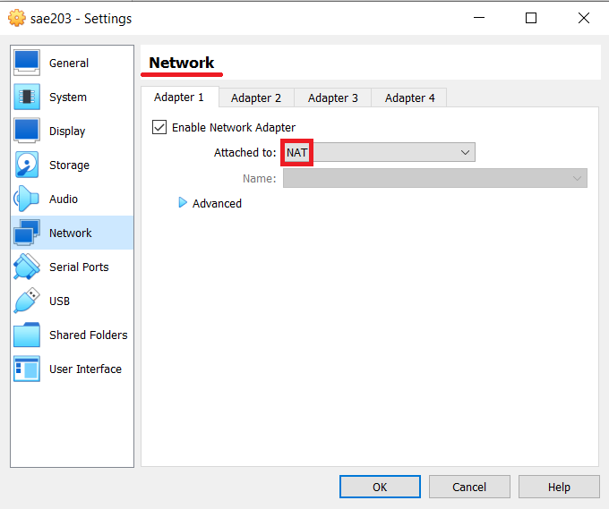

**Quel est le nom du fichier XML contenant la configuration de votre machine ?**

> Ce fichier est *"sae203.vbox"*. 

::: info
Le **format** *XML*, pour information, sert à saisir des informations de configuration basique (paramétrage) compréhensibles pour tous.
:::

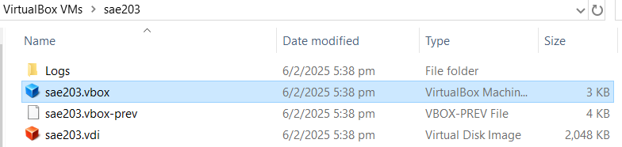

**Sauriez-vous modifier directement ce fichier pour mettre 2 processeurs à votre machine ? Faites-le.**

> Dans la section *Hardware* puis *CPU*, modifier *count* à 2.

::: info
**Note** : Lorsqu'il n'y a aucun *CPU* (processeur), la variable count n'est pas mentionnée.
:::


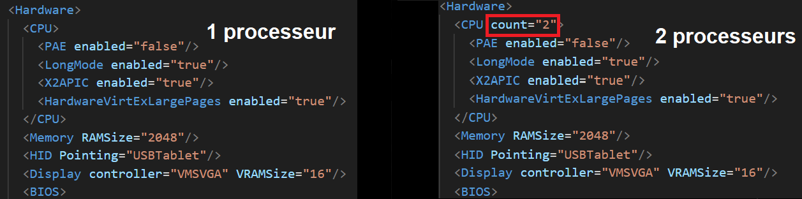

**********

### Question(s) 2. Installation OS de base \

**Qu’est-ce qu’un fichier iso bootable ?**
  
> Un fichier iso *bootable* est une image **disque** qui contient tous les fichiers nécessaires au démarrage d'un système. Il permet soit d'exécuter un **système d'exploitation** en mode "*Live*", soit de procéder à son **installation**, comme ça a été fait pour Debian sur notre machine virtuelle.. [^01-2-1]

**Qu’est-ce que MATE ? GNOME ?**

> *MATE* et *GNOME* sont des interfaces graphiques (GUI) (aussi appelés interfaces, environnements de bureau) pour les systèmes GNU/Linux, **facilitant** l'utilisation du système via une interface visuelle. [^01-2-2]

::: info
Un **serveur** est en quelque sorte un ordinateur/système à la disposition d'autres ordinateurs/systèmes sur un réseau.
:::

**Qu’est-ce qu’un serveur web ?**

> Un **serveur** *web* permet d'accueillir des pages web ou d'autres ressources accessibles via le réseau en utilisant le protocole HTTP.
Le protocole HTTP régit les échanges entre un client Web et un serveur Web. [^01-2-3]

**Qu’est-ce qu’un serveur ssh ?**

> Un **serveur** *SSH* permet d'établir une connexion à distance sur un système **via un terminal**. [^01-2-4]

::: info
Un *terminal* est un **espace de saisie de commandes**.
:::

**Qu’est-ce qu’un serveur mandataire ?**

> Un **serveur** *mandataire*, *souvent appelé proxy*, agit comme un intermédiaire pour la **communication entre deux hôtes**. [^01-2-5]

**********

### Question 3. sudo

**Comment peut-on savoir à quels groupes appartient l’utilisateur user ?**

> La commande `groups` renvoie la liste des groupes où l'utilisateur appartient. Ici, on peut voir que `user` est désormais dans `sudo`[^01-3-1]

::: info
**Rappel** : le groupe sudo représente le groupe des utilisateurs ayant accès au droit de ***super-utilisateur***.
Exemple:
:::

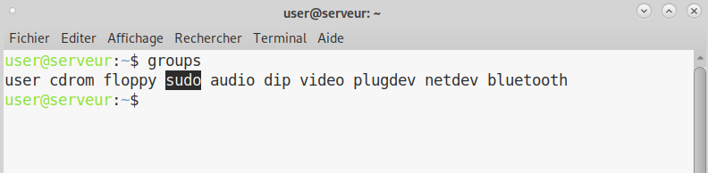

**********

### Question(s) 4. Suppléments invités

**Quelle est la version du noyau Linux utilisé par votre VM ?**

> La commande ```uname -v``` renvoie des **informations** sur la version de notre noyau (*kernel*) utilisé par notre système, dans notre cas la version **4.19.316-1 (2024-06-25)**. [^01-4-1] \
	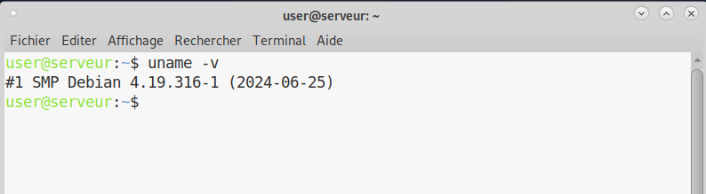
  
**À quoi servent les suppléments invités ? Donner 2 principales raisons de les installer.**

::: box
Les *suppléments invités* permettent une **meilleure intégration** entre la machine virtuelle et le système hôte, d'origine, avec par exemple [^01-4-2] :

- Un *pilote d'affichage* avec **accélération graphique** pour améliorer les performances visuelles de la machine virtuelle.

- La modification de la \hly{résolution d'affichage} lorsque l'on redimensionne la fenêtre du système de la machine virtuelle.

- Un glisser-déposer (\hlr{drag and drop}) pour facilement transférer des fichiers entre le système hôte et l'invité.
:::

**À quoi sert la commande `mount` (dans notre cas de figure et dans le cas général) ?**

> La commande mount est utilisée pour associer un système de fichiers stocké sur un périphérique (comme un disque dur ou une image ISO) à un point d'accès dans l'arborescence des fichiers du système. Ici elle permet de monter l’image iso des **suppléments invités** VirtualBox, située dans le lecteur CD virtuel (mnt) pour une application des contenus. [^01-4-3]

::: warning
**Attention** : Cette commande est à utiliser avec précaution car elle peut occasionner des dommages aux disques.
:::

**********

### Question(s) 4.2 - Quelques questions:

**Qu'est-ce que le projet Debian ? D'où vient le nom Debian ?**

> Le **projet** *Debian* est une **association d'individus** qui ont pour cause commune de créer un système d'exploitation libre. *Debian* est une distribution spécifique du système d'exploitation *Linux* disposant de nombreux paquets. Les ***systèmes Debian*** utilisent actuellement le **noyau** *Linux* ou le **noyau** *FreeBSD*. Le mot *Debian* est la contraction des noms Debra et Ian Murdock, qui ont fondé le projet. [^01-4.2-1]

**Il existe 3 durées de prise en charge (*support*) de ces versions : la durée minimale, la durée en support long terme (LTS) et la durée en support long terme étendue (ELTS). Quelles sont les durées de ces prises en charge ?**

> La **durée minimale** de support d'une version est de 1 an après la sortie de version suivante. La durée de support en long terme (*LTS*) est d'au moins 5 ans. La **durée de support** en long terme étendue étend la durée *LTS* d'encore 5 ans mais il ne s'agit pas d'un **projet officiel** de *Debian*. [^01-4.2-2]

**Pendant combien de temps les mises à jour de sécurité seront-elles fournies ?**

> L'équipe **en charge de la sécurité** prend en charge la **distribution stable** pendant trois années après sa publication. *Debian* étant **avant tout** une *association d’individus et non une entreprise*, ses ressources sont **précieuses**, ainsi elle **ne peut maintenir plus de trois versions**. [^01-4.2-3]

::: warning
Il est préférable d'utiliser une version à jour *en termes de sécurité*.
:::

**Combien de versions au minimum sont activement maintenues par Debian ? Donnez leur nom générique (= les types de distribution).**

::: box
Près de 3 versions courantes existent **au minimum**. Il y a :

- **La distribution stable** contenant la dernière **distribution** officiellement sortie de *Debian*.

- **La distribution testing** contenant les paquets qui n'ont *pas encore* été acceptés dans la distribution stable, mais qui sont en attente de l'être. Le principal avantage d'utiliser cette **distribution** est qu'elle contient des versions plus récentes des logiciels.

- **La distribution unstable** est celle sur laquelle les activités de développement *se déroulent*. Généralement, cette **distribution** est utilisée par les développeurs. [^01-4.2-4]
:::

**Chaque distribution majeure possède un nom de code différent. Par exemple, la version majeure actuelle (Debian 11) se nomme Bullseye. D’où viennent les noms de code donnés aux distributions ?**

> Les noms sont basés sur les **personnages du film** ***Toy Story***. [^01-4.2-5]

**L’un des atouts de Debian fut le nombre d’architectures (processeurs) officiellement prises en charge. Combien et lesquelles sont prises en charge par la version Bullseye ?**

> Près de 9 architectures différentes sont prises en charge par *Debian* [^01-4.2-6]

  - Tableau les présentant : 

  | **Architecture** | **Description** |
  |-|-|
  | *amd64*        | AMD64 PC 64 bits / Intel EM64T / x86-64                                   |
  | *i386*         | i386 PC 32 bits / Intel IA-32                                             |
  | *ppc64el*      | PowerPC 64 bits little-endian Motorola/IBM PowerPC                        |
  | *s390x*        | S390 64 bits IBM S/390                                                    |
  | *armel*        | ARM                                                                       |
  | *armhf*        | Anciens matériels ARM et de plus récentes architectures 32 bits           |
  | *arm64*        | Architectures ARM 64 bits Arch64                                          |
  | *mipsel*       | MIPS 32 bits little-endian                                                |
  | *mips64el*     | MIPS 64 bits little-endian                                                |

**Première version avec un nom de code.**

> Debian 1.1 (Buzz), est la première version, sortie le 17 juin 1996, et contenait 474 paquets. 
Debian a par la suite terminé sa transition vers le format binaire ELF et utilisait le noyau Linux 2.03. [^01-4.2-7]

**Dernière version avec un nom de code.**

> Debian 14 "Forky" est la dernière version à ce jour, annoncée le 13 octobre 2022. Peu d’informations sont encore données à son sujet, mais la version Trixie est actuellement en phase “testing”. [^01-4.2-8]

**********

### Question(s) 5 : ajustement de la pré-configuration

Les principales réponses se trouveront dans le fichier `preseed-fr.cfg`. 

Il est déjà **important** de comprendre ce fichier. Il constitue la configuration de l'installation automatique de notre machine virtuelle, fonctionnant à la suite. Pour rendre ça simple, c'est comme si un humain entrait ces commandes, attendait la fin de chaque exécution, pour ensuite saisir la prochaine ; d'où l'intérêt d'une installation **automatisée** !

::: error
Il sera **normal** de rencontrer des erreurs au cours de l'installation. Nous en avons rencontré beaucoup et nous les détaillerons !
:::

**Modifier votre configuration (et recommencez l’installation) afin de :**

- **Ajouter le droit d’utiliser sudo à l’utilisateur standard.** \

> Ici, nous avons ajouté les droits **sudo** à *user*. \

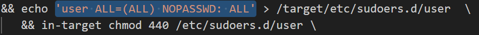 \

::: info
Cette méthode est relativement compliquée à trouver et nous a donc demandé un peu de recherche.
:::

> Pourquoi cette méthode ? Ici nous allons en quelque sorte venir *écrire* dans le fichier *sudoers* (gérant les droits des utilisateurs par le paquet sudo ; se référer à l'explication) [^01-5-0] avec la commande echo, pour y inscrire les règles de droit concernant notre utilisateur user. Comme si un humain venait le faire, mais de façon **automatique** !

::: info
**Pour rappel**, les droits sudo sont les droits administrateur/super-utilisateur, permettant la saisie de commandes plus importantes sur le système.
:::

- **Installer l’environnement MATE.** \

> Ici, nous avons rajouté mate-desktop à la liste des méta-paquets que nous souhaitons rechercher. \

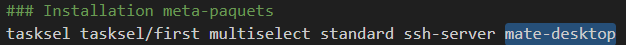 \

- Ajouter les paquets suivants :
  - `sudo` : sinon la gestion sudo est inutile.
  - `git`, `sqlite3`, `curl` : pour préparer l’installation de la semaine prochaine.
  - `bash-completion` : va vous simplifier grandement l’écriture des lignes de commande.
  - `neofetch` : pas très utile mais c’est un classique dans son genre (essayez-le).

```sh
d-i pkgsel/include string sudo git sqlite3 curl bash-completion neofetch
```
\ 

> Ici, il a suffi, après s'être documenté un peu sur l'instruction, de rajouter les paquets demandés sous forme de liste.
La commande, d-i pkgsel est assez **intuitive** puisqu'il suffit uniquement de rajouter les paquets voulus. On peut ajouter *tout ce que l'on veut* à la suite de cette ligne, en plus des autres paquets installés. [^01-5-1]

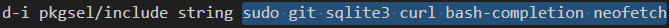 \

::: info
**Rappel** : les paquets sont une liste d'*applications* qui seront installées sur notre système. Ici, ils le sont par défaut, sans un quelconque effort de notre utilisateur *user* !
:::
\ 

**********

Les **fichiers** de l'installation automatisée sont *maintenant* prêts à **l'emploi**.
Pour les appliquer, il faut aller dans le **répertoire** *VirtualBox* de notre machine virtuelle (généralement /users/nomutilisateur/VirtualBox VMs/nommachine) et ajouter le dossier *autoinstall* préparé et les fichiers le contenant. 

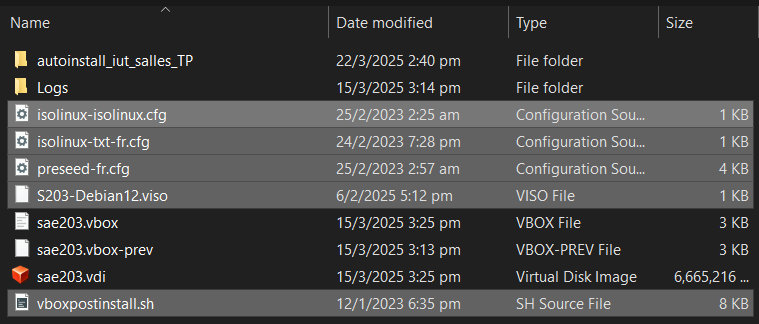 \

De plus, il ne faut pas oublier d'ajouter un ***UUID*** dans le fichier *.viso*. [^01-5-uuid]

::: info
Un ***UUID*** est un *identifiant unique universel* d'une taille de **128 bits**. La machine virtuelle en a besoin pour **identifier** le système.
:::

Pour ce faire, le plus simple est d'en générer un en ligne. N'importe quel générateur suffit.

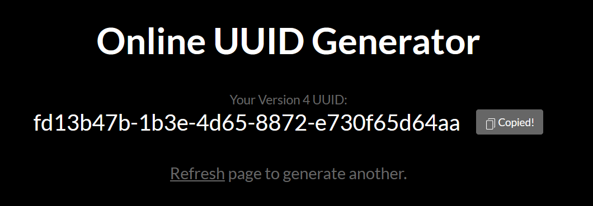 \

Ensuite, il faut l'ajouter dans la case **spécifiée** dans le ficher *.viso*.

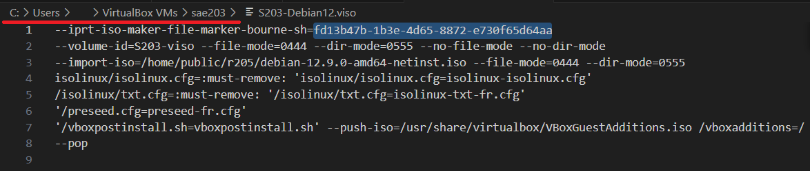 \

Il ne reste maintenant plus qu'à lancer la **machine virtuelle** et attendre.


**********

***C'est donc la fin de la semaine 1.***


> Nous avons globalement constaté que la plupart des difficultés rencontrées pouvaient en **réalité** être répondues *d'elles-mêmes* dans le fichier, qui, par sa **clarté** et ses **indications commentaires**, nous dit souvent implicitement que l'instruction est **déjà écrite** et qu'il n'y a plus qu'à la modifier pour installer le **paquet** que l'on souhaite (par exemple).

> Par ailleurs, notre équipe n'étant **pas toujours** à l'aise avec les commandes bash, il a fallu chercher sur le *Web*, qui nous a donné des réponses (les demandes sont assez **courantes** donc les commandes sont aussi universelles) que l'on a testé, qui ont **parfois marché** et d'autres fois **non**. 
  
> Ce mode d'apprentissage, débutant par des échecs **probables**, se finissant par un succès quasi certain, fait de cette méthode parfois frustrante un moyen finalement **très efficace** pour progresser dans nos compétences.

---

## Semaine 03 : Étude applications clientes

Lors de cette semaine, nous parlerons de *git* et de ses déclinaisons (applications clientes).

Mais tout d'abord, qu'est-ce que *git* ? Il faut le comprendre, car c'est un outil très utilisé dans l'informatique.
Git est très fortement relié à *Linux*. En effet, Git a été **développé** par *Linus Torvalds* (créateur de *Linux*) en 2005 pour répondre aux besoins du projet Linux après l'abandon de *BitKeeper*, un logiciel de **gestion de versions** auparavant utilisé par la communauté Linux. Son objectif était de créer un outil rapide, distribué et fiable pour la gestion du code source. 
Depuis, Git est devenu la **référence** en matière de **gestion de versions**, adopté par la **plupart des entreprises et projets open source**. [^03-0-git]

### Question(s) 0. Configuration globale de git

**Configuration rapide de git**

```sh
git config --global user.name "Prénom Nom" 
git config --global user.email "votre@email"
git config --global init.defaultBranch "master" 
```

Nous avons ajouté notre **nom et email** à la *configuration git*.
Puis, notre \hly{branche} par défaut sera \hlr{master}. 
Cette branche sera la destination de nos fichiers en \hlg{'commit'}. [^03-0-1]

::: info
Un commit est une opération qui envoie les dernières modifications du code source au référentiel, faisant de ces modifications une partie de la révision principale du référentiel. [^03-0-commit]
:::

**********

### Question(s) 1. Préliminaire

**Qu’est-ce que le logiciel *gitk* ? Comment se lance-t-il ?**

> Le logiciel \hlb{gitk} est un **outil graphique** pour visualiser l'historique des commits dans un dépôt Git. Il permet de naviguer facilement entre les commits, de voir les modifications apportées et de suivre l'évolution du projet. [^03-1-1]
Il se lance avec la commande \

```sh
gitk
```

\


**Qu’est-ce que le logiciel *git-gui* ? Comment se lance-t-il ?**

> Le logiciel \hlb{git-gui} est une **interface graphique** pour gérer les dépôts Git. Elle permet d'effectuer des opérations courantes comme les commits, les merges et les pushes, offrant une alternative visuelle aux commandes en ligne de commande. Il est *très* similaire à gitk (le concept sera un peu toujours le même). [^03-1-2]
Il se lance avec la commande \

```sh
git-gui
```

\
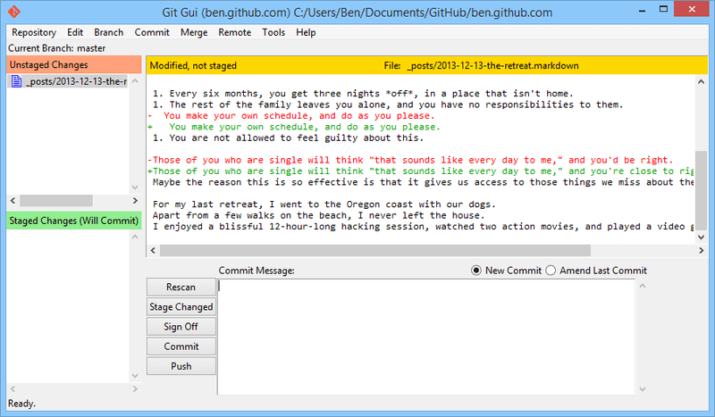

**********

### Question(s) 2. Comparons

> Dans cette partie, nous aurons choisi *smartgit*. \
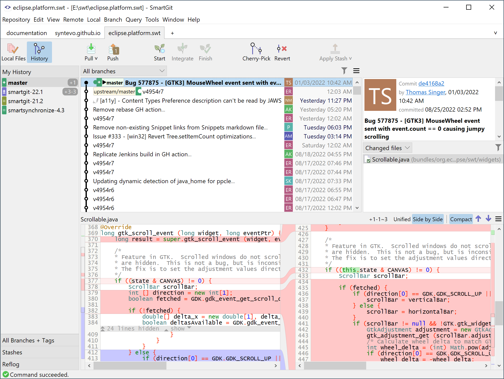

**Pourquoi avez-vous choisi ce logiciel ?**

> Nous avons choisi *smartgit* pour sa gratuité (*à usage non-commercial*) et pour sa bonne réputation.
> Nos **principaux** critères sont la **facilité** d'utilisation pour les outils de base.
> Il propose également des fonctionnalités plus complexes.

**Comment l'avez vous installé ?**

> Il a globalement suffi de suivre les instructions *présentes* sur le site [^03-2-2]
> Nous l'avons installé avec le 'bundle debian' proposé sur le site, qui simplifie le processus en regroupant tous les fichiers nécessaires.
> Il suffit ensuite \hlg{d'exécuter} les commandes suivantes dans un *terminal* :

```sh
sudo dpkg -i <smartgit*.deb>
```

> *dpkg* est l'outil de gestion des packages Debian, et l'option -i signifie "installer".
> le caractère * dans ```smartgit*.deb``` signifie que nous spécifions n'importe quel fichier *commençant par* ```smartgit``` et se terminant par  ```.deb```.

En cas de problème, la commande suivante est utile :

```sh
sudo apt --fix-broken install
```

> *apt* est similaire à *dpkg*, nous servant pour manipuler des *packages* (paquets).
>  ```--fix-broken install``` cette option indique à apt qu'il faut corriger d'éventuelles dépendances manquantes en cas de problème.

**Comparez-le aux outils inclus avec git (et installé précédemment) ainsi qu’avec ce qui serait fait en ligne de commande pure : fonctionnalités avantages, inconvénients…**

> Le logiciel est assez **complet** et a été plutôt facile à *prendre en main*.
Il est possible de faire des *micros-sauvegardes*.
Globalement nous sommes des débutants dans le milieu de git donc nous ne pouvons pas tout lister, mais nous sommes satisfaits de *SmartGit* pour l'utilisation que l'on en a fait. 

Un apprentissage plus \hly{approfondi} de `git` nous sera dispensé tout au long du Semestre 2 dans la ressource **Qualité de développement**, donc il est toujours utile d'en apprendre plus.

**********

### Conclusion du rapport intermédiaire

Ce rapport intermédiaire est désormais **fini**. Du détail a été apporté dans **l'obtention de nos réponses**, ainsi il n'est que **logique** de détailler également la **construction** de ce rapport.

**********

#### Premier parcours

> Dans un **premier temps**, nous avons répondu aux questions sous **forme brute**.
Ensuite, nous avons **décidé** d'une *mise en page type* à reproduire sur **chaque** question (question en gras, réponse en normal).
Nous avons vu les **parties** où il était possible d'utiliser des formules plus **complexes** (tableau, sources, lignes de commande...).

**********

#### Détails

> TeX Live est assez **fourni** (plus de 3000 paquets installés pendant 1h30) donc nous avons testé **beaucoup** de façons de compiler le document (différentes polices, paramètres, templates...).

::: info
*TeX* est, un peu comme le *markdown*, un language de typographie assez avancé laissant **beaucoup de place** au paramétrage. Il est *très utilisé* dans l'écriture de **documents académiques**. Dans notre document, nous en utilisons une partie, *grâce à ses* **nombreuses déclinaisons**.
:::

Enfin, quelques petites retouches ont été apportées, croyant en l'importance des détails.

 - Quelques paramètres | détails utilisés : 

    | Modification | Description |
    |-|-|
    | margin        | 3cm, très bien                                |
    | \hlg{surlignage}         | "macro" de TeX. Trouvé dans la documentation                                         |
    | arborescence fichiers      | Les fichiers, images sont stockés à des endroits précis et de façon propre.               |
    | images        | Modifications rapides de l'image (entourer, surligner) sur GIMP                                            |
    | invites de commandes        | intégration avec '''                                                                        |

Ce **rapport**, car \hlg{intermédiaire}, peut être **sujet** à de futurs changements dans sa version finale.

---

## Semaine 04 : Installation de *Gitea*

Nous attaquons alors cette semaine 4 par une installation de *Gitea*. Commençons sans plus attendre.

### Question(s) 1. A propos de *Gitea*

**Qu'est-ce que Gitea ?**


> *Gitea* est un \hlg{service} de *développement* logiciel tout-en-un, auto-hébergé et sans douleur. Il comprend l'hébergement *Git*, l'examen du code, la collaboration en équipe, le registre des paquets et le CI/CD. Il est similaire à *GitHub*, *Bitbucket* et *GitLab*.

> (Traduction de la documentation officielle [^04-1-1])


**À quels logiciels bien connus dans ce domaine peut-on le comparer (en citer au moins 2) ?**


> *Gitea* peut être comparé, et se compare, à *GitHub EE*, *GitLab CE* (*Community Edition*) et à *BitBucket*. [^04-1-2]
\ 

**Qu’est-ce qu’un fork (dans le domaine du développement logiciel bien entendu) ?**


> Un *fork* est une **duplication**. C'est est un nouveau référentiel qui partage le code et les paramètres de visibilité avec le référentiel « en amont » d’origine. Les duplications sont souvent utilisées pour **itérer sur les idées ou les modifications** avant qu’elles ne soient proposées à nouveau au référentiel en amont, par exemple dans des projets open source ou lorsqu’un utilisateur n’a **pas d’accès en écriture** au référentiel en amont. [^04-1-3]
\

**De quel logiciel Gitea est-il le fork ? Ce logiciel existe-t-il encore ?**


> *Gitea* est le fork, soit la duplication, ou une dérivée, du \hlr{logiciel} *Gogs*. Ce logiciel existe encore, mais n'est **pas très connu**. Les sources sur le fork sont d'ailleurs minces mais **suffisantes**. Le site officiel de *Gitea* mentionne toutefois que **quasiment tout le code a changé**. [^04-1-4]
\

**********

### Installation de Gitea ; opérations

> Nous allons désormais procéder à **l'installation** de *Gitea*, le tout en *expliquant* de façon \hly{détaillée}.
\

- Cette section contiendra : 

  - commandes réalisées **avant, pendant et après** l'installation ;
  - \hlr{contenu} des fichiers créés ;
  - \hlr{contenu} des fichiers de configuration.

Nous **suivrons** les indications de *l'installation binaire* venant de la documentation **officielle** de *Gitea*. Les commandes les plus importantes seront accompagnées d'une image pour renseigner le retour.


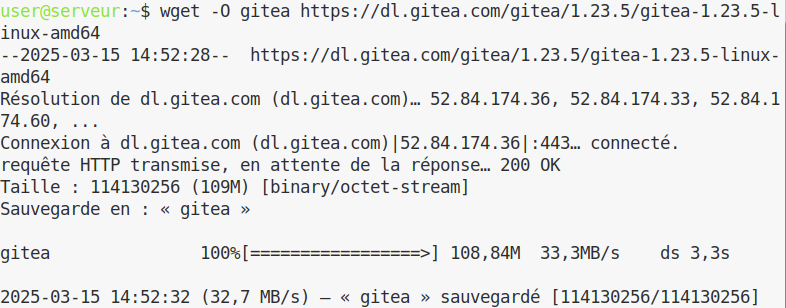 \

Ici, nous avons \hlg{téléchargé} le *binaire* de gitea. Ce fichier contient en quelque sorte le **code source** de *Gitea*. Il sera placé dans notre répertoire courant et nous allons ensuite le manipuler.

Ensuite, la commande 

```sh 
chmod +x gitea
```

rend le fichier **exécutable**.

Pour **s'assurer** que le binaire n'a pas été **modifié**, on **vérifie** sa *signature GPG*. Nous allons vérifier son authenticité en vérifiant la **validité de la signature**. Cela permet de s’assurer que nous avons obtenu la version **officielle** du binaire.

```sh 
gpg --keyserver keys.openpgp.org --recv 7C9E68152594688862D62AF62D9AE806EC1592E2
gpg --verify gitea-1.23.5-linux-amd64.asc gitea-1.23.5-linux-amd64
```

Pour la \hly{culture}, une signature *GPG*, ou *GNU-PG*, est un type de \hlr{signature} beaucoup utilisé sur les systèmes d’exploitation *Linux*, notamment dans notre cas ; la **vérification de fichiers installés**.

\

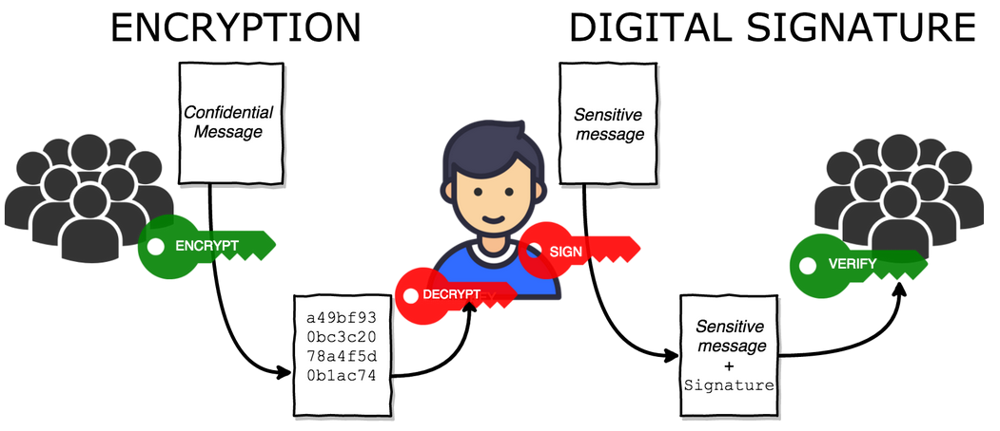 \

::: info
*Image parlante du cas cryptage GPG* [^04-2.1-gpg]
:::


Avant d'installer *Gitea*, nous devons nous **assurer** que *Git *(comme introduit plus haut) est installé.

```sh 
git --version
```

Ensuite, il nous faut **créer** un utilisateur dédié pour *Gitea*.
Ici, nous **ajoutons** un nouvel utilisateur à notre système qui sera nommé *git*.

- Différentes options seront utilisées : 
  - \hly{L'option} *system* signifie que l'utilisateur n'a pas d'accès interactif et possède un UID en dehors de la plage des utilisateurs normaux.
  - \hly{L'option} *gecos* représente la description donnée à l'utilisateur.
  - \hly{L'option} *group* va créer un groupe du même nom que l'utilisateur où il sera ajouté automatiquement.
  - \hly{L'option} *disabled-password* désactive le mot de passe de l'utilisateur.
  - \hly{L'option} *home /home/git* donne ce répertoire comme le répertoire personnel de l'utilisateur.
  - \hlr{Enfin}, cet utilisateur aura le sobre nom de *git*. 

\
 
 \


*Gitea* a besoin de répertoires pour **fonctionner**. Nous devons alors en créer **certains**. Nous donnerons aussi les droits **nécessaires** pour que l’utilisateur *git* puisse les **exécuter**.

**********

*Au lieu de donner une description globale de la chose*, il sera **préférable** – **et préféré ici** de décrire *une à une* les commandes utilisées ;


**```mkdir -p /var/lib/gitea/{custom,data,log}```**

> Établit les répertoires custom, data, et log dans /var/lib/gitea s'ils n'existent pas déjà. L'option -p permet de créer les répertoires parents nécessaires.

**```chown -R git:git /var/lib/gitea/```**

> Change le propriétaire et le groupe de tous les fichiers et répertoires dans /var/lib/gitea/ pour qu'ils appartiennent à l'utilisateur git et au groupe git. L'option -R applique la commande de manière récursive.

**```chmod -R 750 /var/lib/gitea/```**

> Modifie les permissions de tous les fichiers et répertoires dans /var/lib/gitea/ pour que le propriétaire ait tous les droits (lecture, écriture, exécution), le groupe ait les droits de lecture et d'exécution, et les autres utilisateurs n'aient aucun droit. L'option -R applique la commande de manière récursive.

**```mkdir /etc/gitea```**

> Crée le répertoire /etc/gitea s'il n'existe pas déjà.

**```chown root:git /etc/gitea```**

> Change le propriétaire du répertoire /etc/gitea pour qu'il appartienne à l'utilisateur root et au groupe git.

**```chmod 770 /etc/gitea```**

> Modifie les permissions du répertoire /etc/gitea pour que le propriétaire et le groupe aient tous les droits (lecture, écriture, exécution), et les autres utilisateurs (*other*) n'aient aucun droit.

**********

Après avoir **compris** le sens de chaque commande, nous pouvons les **exécuter** *en même temps* (ce qui est prévu dans l’installation).

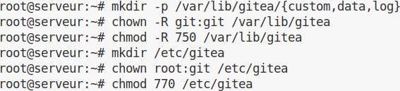 \

Nous allons \hly{maintenant} définir le répertoire de travail de *gitea* dans un espace dédié. Cela signifie que les fichiers seront utilisés à un endroit propre et défini. 

**```export GITEA_WORK_DIR=/var/lib/gitea/```**

> Enfin, nous allons copier le binaire Gitea dans un répertoire où il peut être exécuté par tous les utilisateurs. 

**```cp gitea /usr/local/bin/gitea```**

> Cela va **copier** le binaire Gitea dans /usr/local/bin pour qu'il soit accessible globalement.


Nous pouvons \hlr{maintenant} lancer *Gitea* \hly{sans problème} ***après avoir fait tout le nécessaire***.

::: error
Nous avons rencontré *quelques erreurs* au cours de cette installation mais elles s'expliquaient juste par une **mauvaise lecture** de l'installation recommandée. Il est **important** de tout lire au lieu de juste copier les commandes *une par une*.
:::

::: info
Cette partie est *optionnelle*, mais par soucis du détail, elle sera *naturellement décrite* comme **partie intégrante** de l'installation.
:::

Nous allons **maintenant** créer un service linux pour *Gitea*.
Cela permettra de lancer automatiquement *Gitea* à chaque démmarage du serveur.

Nous pouvons récupérer un fichier de *configuration de service* à modifier ici : https://github.com/go-gitea/gitea/blob/release/v1.23/contrib/systemd/gitea.service

Pour ensuite le placer à cet emplacement : 

**/etc/systemd/system/**

::: info
Il est aussi possible d'obtenir un fichier préconfiguré pour nos réglage avec la commande :

**```wget https://raw.githubusercontent.com/go-gitea/gitea/master/contrib/systemd/gitea.service -P /etc/systemd/system/```** 
:::

Nous pouvons maintenant lancer le service, et, par la suite, il se lancera automatiquement avec la commande :

**```systemctl enable --now gitea```**

Pour vérifier le bon fonctionnement du service (et obtenir des informations sur le *statut* de *Gitea*) on peut utiliser la commande :

**```systemctl status gitea```**

Pour arrêter le service :

**```systemctl stop gitea```**

Pour le relancer :

**```systemctl restart gitea```**

Dans le cas d'un accès au serveur, il faudra permettre l'utilisation d'un port.

Dans le cas d'une machine virtuelle, il faudra faire une redirection de port.

Sinon, il *convient* d'utiliser :

**```ufw allow 3000/tcp```**

::: info

Vous pouvez accéder au serveur depuis un navigateur web grâce à cette url :
\
**localhost:3000** depuis votre machine (ou depuis votre machine princcipale avec une machine virtuelle)

ou alors : 

**"ip serveur":3000** depuis une autre machine
:::

Maintenant, nous pouvons paramétrer *Gitea* par la page *Web* !

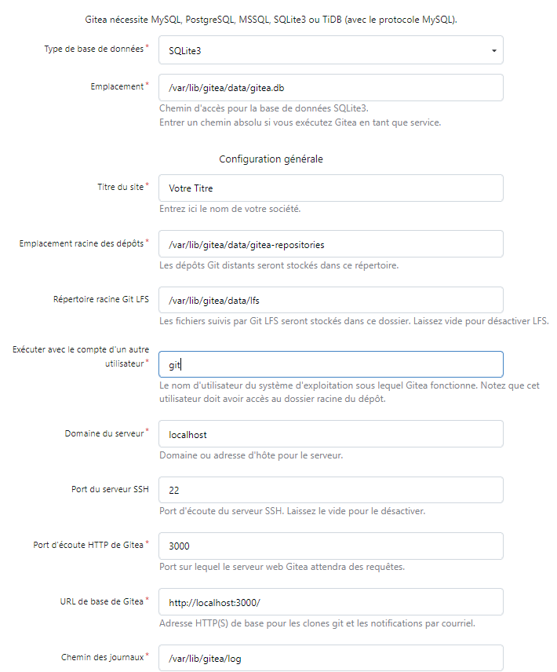 \

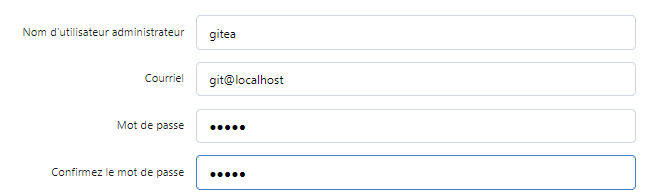 \

::: warning
Il est important de ne pas oublier de redéfinir les droits d'accès aux fichiers de configuration de *Gitea*.
:::

**```chmod 750 /etc/gitea```**

**```chmod 640 /etc/gitea/app.ini```**

Vous pouvez maintenant utiliser les **fonctionnalités** *à part entière* de Gitea !

Vous pouvez **inscrire** de nouveaux utilisateurs et les gérer de façon *intuitive*. \

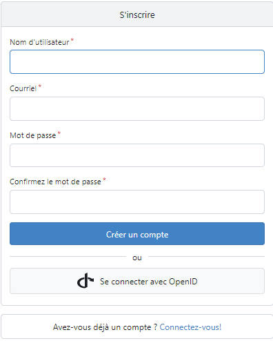 \

 \

**********

### Question(s) 2. Mise à jour

**Donnez la version que vous avez installé et la commande permettant d’obtenir cette information.**

> Pour *obtenir* la version installée de Gitea, nous pouvons utiliser la commande :

**```gitea --version```**

Ici, nous obtenons la version *1.23.5*.

**Comment faire pour mettre à jour le binaire de votre service sans devoir tout reconfigurer ? Essayez en mettant à jour vers la version 1.24-dev.**

> Pour **mettre à jour** le binaire, il faut **télécharger** le *nouveau* binaire de la *version voulue* puis *remplacer l'ancien* dans le dossier **/usr/local/bin**.

Nous pouvons tester en mettant à jour vers la version 1.24-dev avec la commande :

**```wget -O /usr/bin/gitea https://dl.gitea.com/gitea/main-nightly/gitea-main-nightly-linux-amd64```**

::: warning
Il ne faut pas oublier d'arrêter le service avant, pour le relancer après.
:::

**********

### Tests d'utilisation

Le logiciel *Gitea*, après des efforts d'installation (*et de configuration*) **plus ou moins importants**, compte bien nous être utile.

> *Ajout d'un projet depuis l'interface Web ;*

Nous avons ajouté de façon simple les *TP java* du *second semestre* avec l'utilisateur *numéro 1*.

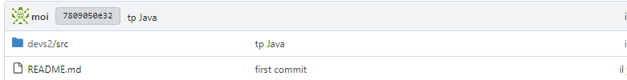 \

::: info
Le *java* est un *langage de programmation* dont l'apprentissage nous est dispensé *tout au long de* la **formation**.

Exemple de code *java* :

```java
public class test {
  public static void main(String[] args){
    System.out.println("je suis java");
  }
}
```
:::

> *Ajout de cette SAé ;*

Nous avons ajouté cette SAé avec l'utilisateur *numéro 2*.

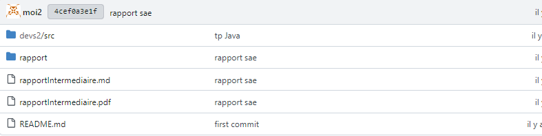 \

> *Partage aux différents utilisateurs ;*

Depuis l'interface *administrateur*, nous pouvons gérer les *comptes des utilisateurs* **ainsi que leurs accès**

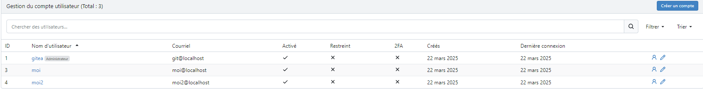 \

Nous pouvons également supprimer un utilisateur de notre projet.

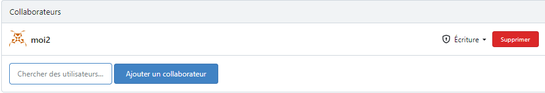 \

D'autres actions sont possibles ;

Les permissions dans Gitea permettent de gérer l'accès aux différentes fonctionnalités d'un dépôt. Par exemple, les unités telles que **le code, les issues, les pull requests, les releases, le wiki, les projets, les packages, les actions et les paramètres** peuvent être configurées avec des *niveaux d'accès spécifiques*. Les niveaux de permission incluent 'Read' (lecture), 'Write' (écriture) et 'Admin' (administration), chacun offrant **des droits d'accès et de modification différents**. [^04-2.2-1]

Il est *plus simple* de visualiser ça sous la forme d'un tableau :

| **Nom**              | **Lecture** (*read*)                                        | **Écriture** (*write*)                             | **Admin**                  |
|-----------------|-------------------------------------------------|--------------------------------------|--------------------------|
| *Code*            | Voir l’arborescence, les fichiers, commits, branches, etc. | "Push" du code.                    | -                        |
| *Issues*          | Voir les issues et en créer de nouvelles.        | Ajouter des labels, assigner, fermer. | -                        |
| *Pull Requests*   | Voir et créer de nouvelles pull requests.       | Ajouter des labels, assigner, fermer. | -                        |
| *Releases*        | Voir les releases et télécharger des fichiers.  | Créer/éditer des releases.          | -                        |
| *Wiki*            | Voir les pages du wiki. Cloner le dépôt du wiki. | Créer/éditer des pages du wiki, "Push". | -                        |
| *Wiki Externe*    | Lien vers un wiki externe.                      | -                                    | -                        |
| *Tracker Externe* | Lien vers un tracker d’issues externe.          | -                                    | -                        |
| *Projets*         | Voir les colonnes des projets.                  | Modifier les issues à travers les colonnes. | -                        |
| *Packages*        | Voir les packages.                              | Télécharger/supprimer des packages.  | -                        |
| *Actions*         | Voir les journaux des actions.                  | Approuver / Annuler / Redémarrer.    | -                        |
| *Paramètres*      | -                                               | -                                    | Gérer le dépôt.          |


::: info
Cette partie sur *gitea* et sa configuration a été assez compliquée pour nous en comparaison au reste du rapport. De plus, nous n'avons pas aimé faire cette partie, nous l'avons souvent trouvé **frustrante**. Le fait que ce soit la dernière partie y contribue sûrement.
Des problèmes comme la *fusion de branches* et la *gestion des accès* ont causé beaucoup de trouble.


Néanmoins il a *fallu avancer* et avec **assez de recherche et d'essais**,  *le travail finit toujours par payer*.


Nos **principales erreurs** étaient dues à de l'inattention et parfois une précipitation *sans toujours* lire la documentation. Avec une ***lecture assidue*** de la documentation et de forums de *déboggage* aux problèmes courants, cela devient **plus facile**. 
:::

**********

### Pour aller plus loin

> Il n'y a de \hlr{limite} que notre **imagination**, donc cette \hlg{partie} est *naturelle*.

**Qu’est-ce que l’intégration et la livraison continue ?**

> L’**intégration continue** (CI) est une pratique logicielle qui nécessite un *committing* fréquent du code dans un dépôt partagé. La plupart du temps, le fait de commiter le code permet de détecter plus rapidement les \hlr{erreurs}, et réduit la quantité de code dont un **développeur** a besoin pour le débogage lorsqu’il recherche la source d’une *erreur*. Les mises à jour fréquentes du code *facilitent* également la fusion des modifications apportées par *différents membres* d’une équipe de développement logiciel. 

> La **livraison continue** consiste à ce que les développeurs de logiciels suivent des cycles courts et continus pour mettre à jour le code, tout en faisant appel à **l'automatisation** pour accélérer la sortie des nouvelles versions. Ce mot va de pair avec le métier/la catégorie de *DevOps*. [^04-3-1]

**Ajoutez et testez ces fonctionnalités (avec vos sources Java ou avec votre rapport markdown).**

> Cette partie est présente dans les ***Tests d'utilisation***.

::: error
Il est possible que nous ayons mal compris le sujet de cette question.
:::

---

## Semaine 05 : Rendu

### Conclusion


\begin{center}
\Huge {Ce rapport est désormais terminé. Nous avons pu explorer les possibilités offertes par Pandoc. Voici un retour sur notre expérience :}
\end{center}


- Les *principaux points* qui ont \hly{marqué l'avancée du rapport} :
  - Le projet ***pandoc latex template master***, amélioration de *eisvogel* disponible sur *github*, est un ensemble de *templates* extrêmement complet et fourni avec beaucoup d'exemples nous a plus que satisfait sur la mise en page que nous souhaitions. Nous ne trouvions pas de bons templates ou alors ils étaient incompatibles avec notre format. Les *macros* TeX ont beaucoup aidé pour aller plus loin en terme de graphisme. Ensuite, nous avons beaucoup joué avec les **fichiers** *TeX*, les **tailles**, les **polices**... tout cela pour trouver *chaussure à notre pied*.

  ::: info
  Dans notre cas, un *template* TeX est une façon de *styliser* notre document en modifiant des détails comme le placement des objets, les **couleurs**, ou tout simplement l'amélioration **graphique globale** *à l'œil*.
  Par exemple, cette boîte de texte est permise par le template utilisé.
  :::

  - Ainsi, nous aurions *parfois préféré* écrire ce rapport entièrement en **TeX** et ses déclinaisons car nous pensons qu'il est plus complet et adapté pour obtenir la qualité que nous souhaitons ;

  - Le format **Markdown/Pandoc** reste très bien et il n'est pas un problème, c'est juste que *TeX* et ses déclinaisons nous permettraient d'aller encore plus loin et nous l'essaierons pour de futurs projets. 

**********

- Mais surtout, **beaucoup de positif est à retenir !**  
  - Auparavant, nous pensions que les documents que nous pouvons trouver dans les sujets officiels étaient compliqués à obtenir. **En réalité**, après avoir obtenu la bonne configuration, il devient très facile de produire rapidement des documents à l'allure propre et soignée. 

  - Notre **marge de progrès** est encore grande car ce projet n'est qu'une première introduction dans l'écriture de rapports au format académique.

  - D'autres **SAé** pourront être écrites dans le même thème en excluant toutes les heures de recherche que nous avons dû faire pour obtenir ce type de document. C'est un **investissement** à prendre mais il est très probable qu'il soit rentable dans le futur ! 

  - Enfin, nos **connaissances** en **réseau/installation machine**, le support de ce document, ont pu être améliorées là où certaines lacunes pouvaient subsister.


\

*Au cours de ces* \hlr{5} *semaines*, ce projet nous aura donc **beaucoup** appris sur les \hlg{réseaux}, les \hly{systèmes}, mais *surtout* sur une **nouvelle manière de travailler académiquement**.

\

**********

\begin{center}
\vfill
\Huge \textbf{\textit{Merci d'avoir consulté cette présentation}}
\vfill
\end{center}

**********

[^01-1-1]: https://fr.wikipedia.org/wiki/Processeur_64_bits
[^01-1-2]: https://fr.wikipedia.org/wiki/Network_address_translation

[^01-2-1]: https://en.wikipedia.org/wiki/Optical_disc_image
[^01-2-2]: https://mate-desktop.org/fr/, https://www.gnome.org/about
[^01-2-3]: https://fr.wikipedia.org/wiki/Serveur_web
[^01-2-4]: https://wiki.debian.org/fr/SSH
[^01-2-5]: https://fr.wikipedia.org/wiki/Proxy

[^01-3-1]: https://wiki.debian.org/SystemGroups

[^01-4-1]: https://debian-facile.org/doc:systeme:uname
[^01-4-2]: https://docs.oracle.com/cd/E26217_01/E35193/html/qs-guest-additions.html
[^01-4-3]: https://manpages.debian.org/bullseye/manpages-fr/mount.8.fr.html, https://www.debian-fr.org/t/mount-et-fstab-pour-les-nuls/22623

[^01-4.2-1]: https://www.debian.org/intro/about.fr.html,https://www.debian.org/doc/manuals/debian-faq/basic-defs.fr.html#pronunciation
[^01-4.2-2]: https://wiki.debian.org/fr/LTS
[^01-4.2-3]: https://www.debian.org/security/faq.fr.html#lifespan
[^01-4.2-4]: https://www.debian.org/releases/index.fr.html
[^01-4.2-5]: https://people.debian.org/~miriam/toy_story/
[^01-4.2-6]: https://wiki.debian.org/fr/DebianBullseye#Architectures
[^01-4.2-7]: https://fr.wikipedia.org/wiki/Historique_des_versions_de_Debian
[^01-4.2-8]: https://www.debian.org/releases/trixie/,https://www.debian.org/releases/index.fr.html,https://wiki.debian.org/DebianForky

[^01-5-0]: https://doc.ubuntu-fr.org/sudoers
[^01-5-1]: https://www.debian.org/releases/stable/s390x/apbs04.fr.html
[^01-5-uuid]: https://docs.oracle.com/en/virtualization/virtualbox/6.0/admin/viso.html, https://en.wikipedia.org/wiki/Universally_unique_identifier

[^03-0-git]: https://git-scm.com/book/en/v2/Getting-Started-A-Short-History-of-Git

[^03-0-1]: https://git-scm.com/book/fr/v2/Les-branches-avec-Git-Les-branches-en-bref, https://docs.syntevo.com/SmartGit/Latest/Manual/GitConcepts/CommonTerms
[^03-0-commit]: https://en.wikipedia.org/wiki/Commit_(version_control)

[^03-1-1]: https://git-scm.com/docs/gitk
[^03-1-2]: https://git-scm.com/docs/git-gui

[^03-2-2]: https://www.syntevo.com/smartgit/download/#installation-instructions

[^04-1-1]: https://docs.gitea.com/
[^04-1-2]: https://docs.gitea.com/installation/comparison
[^04-1-3]: https://docs.github.com/fr/pull-requests/collaborating-with-pull-requests/working-with-forks/fork-a-repo
[^04-1-4]: https://docs.gitea.com/, https://blog.gitea.com/welcome-to-gitea/, https://news.ycombinator.com/item?id=13452025

[^04-2.1-gpg]: https://cran.r-project.org/web/packages/gpg/vignettes/intro.html

[^04-2.2-1]: https://docs.gitea.com/usage/permissions

[^04-3-1]: https://docs.github.com/fr/actions/about-github-actions/about-continuous-integration-with-github-actions, https://about.gitlab.com/fr-fr/topics/continuous-delivery/ https://learn.microsoft.com/fr-fr/devops/deliver/what-is-continuous-delivery
